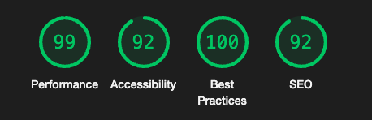
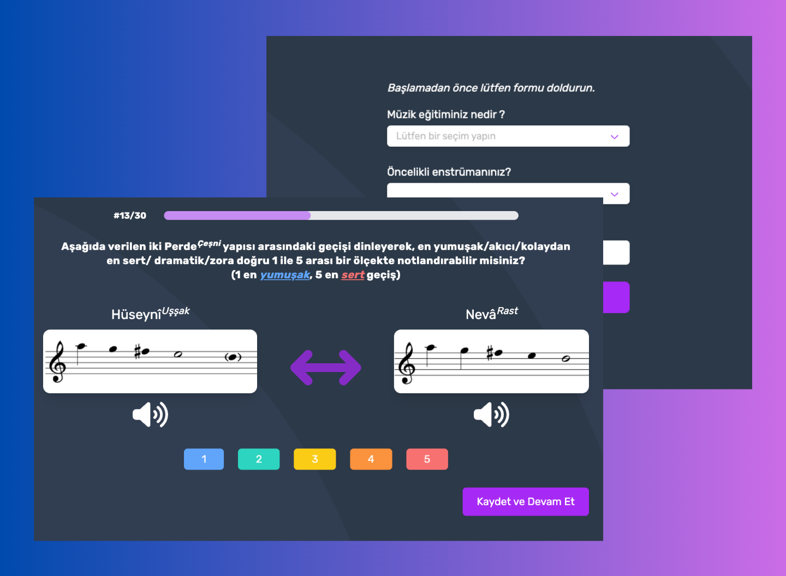

# SurveyNetz - Music Transition Survey App 🎵

## 🌟 Features

- **User Profile Setup**: At the start, users are prompted to provide their music education level, the instrument they play, and their age for personalized survey tracking.  
- **Interactive Survey**: Users listen to two examples of musical transitions and evaluate the smoothness or difficulty of the transition on a scale of 1 to 5 (1 being the smoothest and 5 the most dramatic).  
- **Dynamic Navigation**: After submitting their response, users are seamlessly guided to the next question in the survey.  
- **Firebase Integration**: Survey results are securely stored and managed in Firebase for real-time data analysis.  
- **Beautiful Icons**: Eye-catching icons enhance the UI, using FontAwesome and Iconify.  
- **Responsive Design**: The app is optimized for all screen sizes to ensure a great experience on any device.  

## 🛠️ Technologies Used

- **Vue 3**: Modern framework for building dynamic and reactive UIs.  
- **Pinia**: Simple and intuitive state management.  
- **Tailwind CSS**: Utility-first CSS framework for rapid and responsive styling.  
- **Radix Vue**: Accessible and customizable UI primitives.  
- **VueUse**: Powerful Vue 3 utilities for enhanced functionality.  
- **FontAwesome & Iconify**: Rich icon libraries for a polished and professional look.  
- **Firebase**: Real-time database for storing user responses securely.  
- **Vite**: Fast and modern development build tool for Vue.  

## 🌐 Live Demo  

[Visit SurveyNetz](https://surveyapp-bc928.web.app/)  

## 🌟 Lighthouse Score  

  
    

  

## 🌄 Preview  

  
    

  

## Author  

- **LinkedIn**: [Gümrah Sindar](https://www.linkedin.com/in/gumrahsindar/)  
